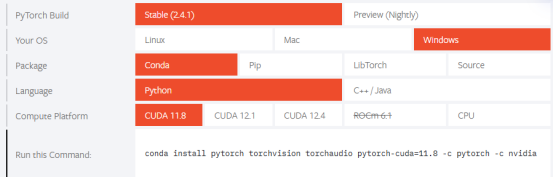
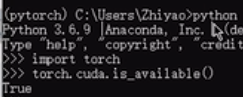

Pytorch 环境安装
1、安装anconda
2、创建虚拟环境conda create 
3、安装 cuda

清华镜像源：https://blog.csdn.net/zzq060143/article/details/88042075

测试是否成功：

ls /etc/yum.repos.d/ 查看源

清理和更新 yum 缓存
如果你更改了源或配置，最好先清理 yum 缓存：

    sudo yum clean all
    sudo yum makecache

ps aux | grep yum 查看运行的进程
sudo kill -9 113801 杀死进程