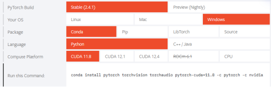
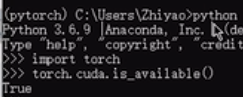
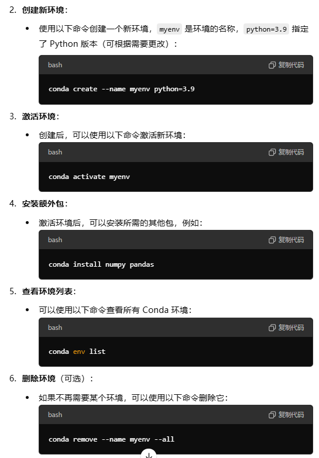
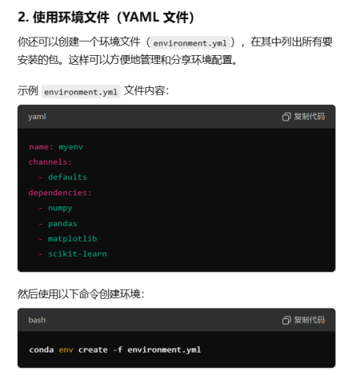
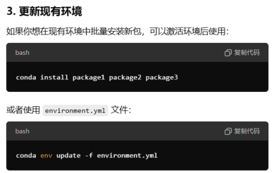
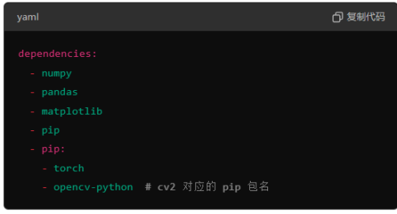
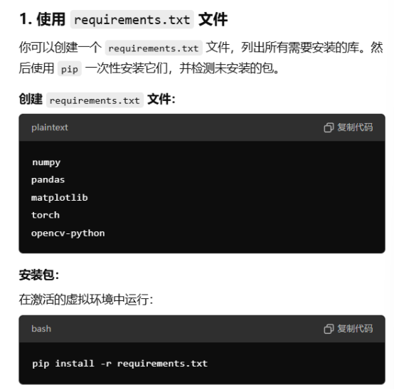

Pytorch 环境安装
1、安装anconda
2、创建虚拟环境conda create 
3、安装 cuda

清华镜像源：https://blog.csdn.net/zzq060143/article/details/88042075

测试是否成功：

ls /etc/yum.repos.d/ 查看源

清理和更新 yum 缓存
如果你更改了源或配置，最好先清理 yum 缓存：

    sudo yum clean all
    sudo yum makecache

ps aux | grep yum 查看运行的进程
sudo kill -9 113801 杀死进程

pycharm连接远程服务器 https://blog.csdn.net/maoliminmaomao/article/details/140304134

### 一键配置环境的方法
一、

可以在dependencies：中加入python=3.8

切记，yml也可以用pip下载，但是必须保证在虚拟环境下，即activate后

二、

    import subprocess
    # 要安装的包列表
    packages = ["numpy", "pandas", "matplotlib", "torch", "opencv-python"]

    # 获取已安装的包
    installed_packages = subprocess.check_output(["pip", "list"]).decode("utf-8").splitlines()
    installed_packages = [pkg.split()[0] for pkg in installed_packages[2:]]  # 排除标题

    # 安装未安装的包
    for package in packages:
        if package not in installed_packages:
            print(f"Installing {package}...")
            subprocess.call(["pip", "install", package])
        else:
            print(f"{package} is already installed.")