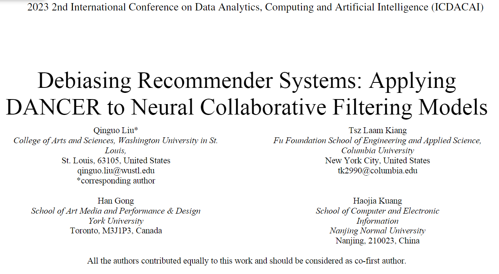
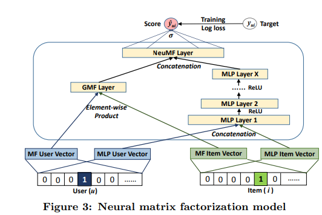

### 背景

随着大数据和人工智能的迅速发展，推荐系统在电子商务、流媒体和社交媒体等领域的应用变得越来越广泛。然而，大多数现有的推荐模型未能充分考虑到用户偏好和选择性暴露的动态变化。用户的偏好可能随时间、情境、甚至外界影响而改变，而推荐系统往往假设用户的行为是静态的。此外，选择偏差，即用户接触到的物品并非随机选择，进一步加剧了推荐的偏误。这种局限性使得推荐系统在面对长时间用户交互时，难以有效处理时间变化和用户行为的动态性。因此，研究如何减轻动态选择偏差对推荐系统的影响，具有重要的现实意义。

### 目的

本文通过使用MovieLensLatest-small的半合成数据集，探讨将神经协同过滤（NCF）与DANCER去偏方法相结合的效果。评估了不同倾向评分和神经网络架构的NCF模型在减少选择偏差方面的表现，重点分析了NCF模型的敏感性以及与DANCER方法的结合效果。

### 结论

尽管初步实验结果尚未超越DANCER-TMF模型的表现，但通过对NCF模型的敏感性分析，我们发现某些参数对模型性能的影响较大，为后续研究提供了调整方向。可以考虑进一步优化动态倾向评分的估计精度，以及探索更复杂的神经网络结构来提升NCF模型的表现。此外，结合其他去偏方法如IPS或最近的对抗去偏算法，可能会进一步改善模型的泛化能力和推荐质量。

### NCF与传统矩阵分解的对比：

传统的矩阵分解方法（如潜在因子模型）假设用户和物品之间的关系是线性的，即MF内积太过简单，很难表示出特征的复杂结构而 NCF 则通过多层神经网络的结构引入了对非线性关系的建模。NCF 提高了模型的灵活性，可以学习到更复杂的交互模式。

* NCF模型的核心结构由以下几部分组成：用户和物品的嵌入层、全连接层（MLP）以及激活函数。用户和物品的嵌入表示会通过多层感知机（MLP）进行多层次的非线性变换，以捕捉用户与物品的复杂交互模式。通过引入DANCER去偏方法，我们在NCF的目标函数中嵌入动态倾向评分，用以调整损失函数，修正选择偏差对模型的影响。

在NCF模型的目标优化过程中，DANCER的核心功能在于通过动态倾向评分来校正选择偏差。DANCER通过引入一个偏差校正网络，该网络利用用户的历史行为和时间变化来动态调整倾向评分，使得推荐系统能够更准确地反映用户的实际兴趣。

DANCER 主要作用于 NCF 的损失函数，即图中目标（Target）的优化部分。具体来说，DANCER 在优化过程中通过调整损失函数来处理选择偏差，以提高推荐系统的准确性。

 

### DANCER 与 NCF 的结合

在 NCF 的目标优化过程中，DANCER 的作用可以总结为以下几点：

动态倾向评分：DANCER 使用动态倾向评分（或曝光概率），该评分考虑了用户和物品的时间因素和选择偏差。倾向评分帮助调整损失函数，以减少由于选择偏差造成的误差。

偏差校正：DANCER 通过引入一个偏差校正网络，对选择偏差进行建模和校正。这种校正机制会根据用户行为的历史数据和时间动态调整倾向评分，从而更准确地反映用户的实际偏好。

