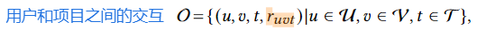
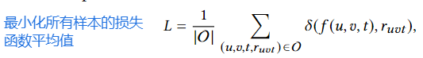

## 摘要

时间感知推荐已被广泛研究用于对用户动态偏好进行建模，并提出了许多模型。然而，这些模型往往忽略了用户可能不会在时间线上表现均匀的事实，并且观察到的数据集可能会受到用户内在偏好或以前的推荐系统的偏见，从而导致模型性能的下降。我们提出了一个因果去偏的时间感知推荐框架来准确学习用户偏好。我们通过因果图制定时间感知推荐任务，识别项目和时间级别的两种类型的偏差。
为了优化理想的无偏学习目标，我们提出了一种基于逆倾向得分 (IPS) 的去偏框架，并将其扩展到双鲁棒方法。
考虑到用户偏好可能多样且复杂，这可能导致未测量的混杂因素，我们开发了一种敏感性分析方法来获得更准确的 IPS。我们从理论上绘制了所提出的方法和理想学习目标之间的联系，据我们所知，这是研究界的第一次。我们对三个真实世界的数据集进行了广泛的实验，以证明我们模型的有效性。为了促进这一研究方向，我们在 https://www-cdtr.github.io/ 上发布了我们的项目。

## 介绍

推荐系统的关键在于对用户偏好的准确理解。在现实场景中，用户偏好通常表现出动态属性。例如，在电子商务推荐中，用户在出售时可能会购买更多的项目。在电影推荐中，由于假日情绪，在周末可能会给出更高的评级。为了捕捉用户偏好的动态特性，研究人员设计了许多有前途的时间感知推荐模型。例如，TimeSVD++ [23] 将时间信息合并到矩阵分解方法中。BPTF[42]利用张量分解来捕获用户、项目和时间交互。

虽然上述模型取得了显着的成功，但一个重要的问题在很大程度上被忽略了，即观察到的数据集可能会受到用户内在偏好或以前的推荐模型的偏见。如图 1 所示，用户是科学虚构的粉丝。因此，在她的观看记录中，我们可以观察到比其他类型的电影更多的 sci-fi 电影。如果模型是基于这样的数据集学习的，如果使用相同的权重（即以无偏的方式）[4] 评估不同类型的电影，则性能可能不令人满意。从交互时间的角度来看，由于观看习惯，用户在周末观看更多的电影，而在工作日，交互非常稀疏。有了这些记录，模型将更多地了解用户周末行为模式（例如，倾向于给出更高的评级），这可能不适用于工作日。然而，理想的时间模型应该准确估计用户对所有交互时间的偏好。上述项目和时间级偏差共同影响观察到的数据集，基于它们学习的模型可能存在偏差，并且在弱势项目/时间上表现不佳。

为了缓解上述问题，在本文中，我们提出了一个因果去偏的时间感知推荐框架（简称 CDTR）。特别是，我们通过因果图制定了时间感知推荐任务，在此基础上我们分析了项目偏差和时间级偏差的原因。为了纠正这些偏差，我们根据逆倾向得分 (IPS) [31] 调整训练样本。尽管这似乎是一个简单的想法，但存在许多挑战。首先，去偏推荐之前已经得到了广泛的研究。然而，以前的工作只关注项目级别的偏差。在我们的问题中，有两种类型的偏差，即项目和时间级别的偏差。如何联合建模和纠正它们需要仔细的设计。然后，准确估计推荐系统的IPS并不容易，因为数据集可能非常稀疏和嘈杂。以前的工作通常通过构建双鲁棒 (DR) 模型 [38] 来缓解这个问题。然而，如何将这些模型扩展到时间感知设置尚不清楚。最 后，由于用户偏好复杂，数据集中无法记录许多未测量的混杂因素。如何处理它们也是一个挑战。

为了克服上述挑战，我们首先定义理想的无偏学习目标。然后，我们部署了两个独立的模型分别估计项目和时间的倾向分数，这些分数有望灵活地捕获项目/时间观察模式。基于这些倾向得分，我们设计了一个时间感知的去偏推荐框架，并将其扩展到双鲁棒方法。为了揭示这些方法的合理性，我们从理论上证明它们对理想目标没有偏见。为了捕捉未测量的混杂因素，我们通过定量指示未混淆程度开发了一种敏感性分析方法 [9]。基本上，我们首先在范围内找到“最坏情况 IPS”以最大化损失函数，然后通过固定 IPS 最小化以学习参数。对于所提出的方法，我们从理论上证明目标是上一个理想目标的边界。为了证明我们框架的有效性，我们将其应用于不同的时间感知推荐模型，并基于三个真实世界的数据集进行了广泛的实验。

值得注意的是，我们注意到动态去偏推荐模型有一个开创性的工作[16]。然而，我们的论文存在显着差异。首先，我们的模型是从因果的角度得出的。特别是，我们通过因果图制定了时间感知推荐任务，这使我们能够清楚地了解项目和时间级别的偏差，并意识到潜在的未测量混杂因素。然后，我们提出了一种双重鲁棒方法来提高估计精度。最后，我们提供了我们模型的一系列理论理解。

本文的主要贡献可以总结如下:
•我们建议从因果的角度构建一个去偏的时间感知推荐框架。
•为了实现这一目标，我们设计了一个基于IPS的模型，并通过构建双鲁棒方法和显式建模未测量的混杂因素来扩展它。
•我们对设计的模型进行了一系列理论分析。
•进行了大量的实验来证明模型的有效性，我们已经在https://www-cdtr.github.io/上发布了我们的项目。

## 相关工作

### 去偏推荐

近年来，由于许多推荐系统存在会降低推荐性能的偏差，去偏推荐的主题引起了极大的关注。推荐数据集通常包含不同类型的偏差，因为数据是观察的，而不是实验的。为了消除数据偏差，近年来见证了大量的去偏推荐框架。Schnabel等人[31]提出了一种通过将逆倾向评分纳入传统的矩阵分解模型来消除项目曝光偏差的方法。为了更准确地估计倾向得分，[44]开发了一种基于影响函数的方法来纠正推荐系统中的偏差。[38]提出的另一种方法结合了误差imputation和逆倾向评分，设计了一种双鲁棒无偏推荐方法。随后，研究人员专注于进一步优化双鲁棒方法，使用各种技术来减少偏差和方差。为此，[7]将各种双鲁棒方法制定为一个统一的通用范式，并进一步提出减少偏差并在偏差和方差之间实现更好的权衡。

未测量的混淆是推荐系统领域的一个常见问题，其中可能存在影响用户偏好和项目评级的隐含因素，但可用数据没有捕捉到这些因素。响应时，研究人员开发了各种技术来解决未测量混淆的问题。第一行是使用统计和机器学习方法对未测量混淆的影响进行建模和估计。[39]使用神经网络对未观察到的潜在混淆对推荐结果的影响进行建模，并将其纳入优化过程。[46]提出了iDCF，一个通用的去混淆推荐框架，该框架应用近端因果推理来推断未测量的混杂因素并识别反事实反馈。另一条线是使用敏感性分析来学习一个健壮的模型，该模型考虑了边界内未测量的混杂因素。在因果推理领域，[19]引入了混淆鲁棒策略，该策略考虑了可能的未观察到的混淆。同样，在 [9] 中，作者假设观察到的混淆对推荐系统的影响是有限的。他们使用敏感性分析来估计这种影响范围，然后利用对抗学习构建一个推荐系统，该系统对这个极限内未观察到的混淆具有鲁棒性。

上述大多数模型只考虑项目视角的偏差。然而，在我们的框架中，我们共同考虑了项目和时间级别的偏差。我们还通过从项目和时间的角度进行敏感性分析，提高了推荐系统对未观察到的混淆的鲁棒性。与我们的论文最相似的工作是 [16]，但如前所述，建模视角、框架组件和理论分析存在显着差异。

### 动态推荐

#### 与时间相关的推荐

近年来，这种特定类型的推荐引起了研究界的广泛关注。在这种类型的模型中，时间被用来按时间顺序对项目进行排序，模型更多地关注沿时间线的项目相关性。顺序推荐[36]，基于会话的推荐[35]和nextbasket推荐[43]都属于这个类。例如，He等人[13]提出了可能性，假设用户行为可以近似为马尔可夫过程，其中当前动作只受最近的决策的影响。Fossil将FISM[18]和马尔可夫链结合起来建模，其中FISM用于对长期兴趣进行建模，马尔可夫链用于对短期兴趣进行建模。近年来，研究人员开始探索 RNN 在推荐系统领域的应用，特别是对于顺序推荐任务。Hidasi等人[15]提出了一种基于gru的基于会话的推荐方法，以更少的参数实现了最先进的性能。[20] 使用 self-attention 对之前交互的项目的影响进行建模。[33] 利用双向 Transformer 对用户行为进行建模。此外，许多模型结合了绝对时间信息，以突出连续项目之间的时间间隔对用户决策的重要性[45]。

#### 时间感知推荐

在这类方法中，时间被用作上下文信息，这将直接影响模型预测。例如，[23] 将时间信息与矩阵分解模型相结合，用户和项目属性由时间潜在向量表示。[10]对较旧的用户行为施加指数衰减率，以做出更合理的估计。[42] 是一种张量分解方法，其中时间信息被视为捕获用户动态偏好的附加维度。[6]利用深度卷积神经网络来捕获时间和用户项之间的非线性相关性。

我们的论文针对时间感知推荐。然而，与之前的工作不同，我们的目标不是开发一个额外的模型来更好地合并时间信息。我们揭示了一个基本问题，即观察到的时间信息可能会因用户选择偏好而产生偏差。此外，我们构建了一个去偏框架，可以应用于之前的大多数时间感知推荐模型

## 问题表述

观察到的数据集可能会因用户自选择偏好或使用的推荐系统而倾斜，这可能会对学习模型产生偏差。
    
比如用户喜欢看科幻电影，导致数据集全是科幻电影，从而模型只推荐科幻电影，忽视了用户的潜在兴趣

## 结论和未来工作

在本文中，我们提出了一个因果去偏推荐框架，我们首先设计了一个基本的IPS模型，然后将其扩展到双鲁棒方法，以进一步提高其性能。此外，我们还提出了一种敏感性分析方法来捕获未测量的混杂因素。除了引入模型设计之外，我们还提出了一系列理论分析，有望在我们的框架中提供更深入的理解。实际上，仍有改进的余地。首先，可以将我们的框架扩展到顺序推荐的设置，其中时间不用作上下文信息，而是按时间顺序对项目进行排序。此外，直接建模连续时间信息也可能很有趣，其中倾向得分应该遵循连续分布。