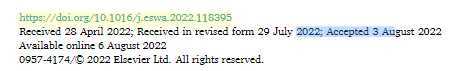

### 背景

在用户信息和用户行为的详细知识难以获得的情况下，基于会话的推荐是必不可少的。基于会话的推荐(SBR)依赖于当前的匿名会话序列来预测下一个动作。最近，循环神经网络等序列建模方法已广泛用于基于会话的推荐中用户偏好建模。然而，现有的SBR方法通常忽略了交互项目的点击时间，导致用户偏好模型不准确，推荐效果不佳。

### 目的

在本文中，提出了一种时间感知神经网络来模拟SBR任务中的动态用户偏好。它可以结合用户的一般兴趣和主要目的，获得动态用户偏好来生成推荐

### 结果

本文的主要贡献如下:

* 提出了一种基于GNN和注意力机制的SBR方法，该方法考虑了用户偏好建模中用户的一般兴趣和主要目的。
* 开发了一种新的带有项目嵌入、点击时间嵌入和会话嵌入的注意力神经网络作为动态用户偏好模型的输入。
* 进行了大量的实验来比较我们的方法和最先进的SBR方法的top-k推荐性能。

实验结果表明方法的有效性，改进具有统计学意义，置信度为 95%。我们的方法显着且一致地优于最先进的基于会话的推荐方法。

### TNARM流程

在本文中，我们提出了一种时间感知神经注意力推荐模型（TNARM）。

1、首先，构造一个全局会话图基于所有会话，并使用图神经网络 (GNN) 来学习项目的嵌入。

2、然后，使用门控循环单元 (GRU) 来细化项目嵌入并根据当前会话对用户的一般意图进行建模。

3、接下来，使用时间感知神经网络来提取会话中用户的主要目的。

4、最后，结合用户的一般兴趣和主要目的来获得动态用户偏好向量并用于预测。向用户推荐预测分数最高的前 k 个项目。

输入层：这一步将会话序列项目和时间信息转换为两个独立的向量，分别是：
   
* 项目向量：表示用户在当前会话中交互的项目。
* 点击时间向量：表示用户点击每个项目的具体时间信息。

嵌入层（Embedding Layer）

* 项目嵌入：通过嵌入矩阵将每个项目vi映射到一个低维嵌入向量。
* 时间嵌入：时间信息ti也通过线性嵌入函数映射到嵌入向量，便于后续的模型处理。
* 输出：会话项目和时间分别转换成低维嵌入向量，用于接下来的层次。

图神经网络层（GNN Layer）
* 全局嵌入（Global Embedding）：首先基于所有会话数据，使用GNN计算项目的全局嵌入，目的是捕捉项目之间的全局关系和用户的总体兴趣。总体兴趣就是通过多个会话的多个项目的整体关联来学习
* 局部嵌入（Local Embedding）：通过GRU（门控循环单元）来处理当前会话中的项目序列，获取会话中的局部嵌入，反映用户在当前会话中的短期兴趣。短期兴趣就是通过当前会话中的所有项目来学习
* 输出：全局嵌入和局部嵌入分别用于后续的兴趣建模。

注意力层（Attention Layer）
* 目的：识别用户在当前会话中的主要目的，捕捉最重要的交互项目。

* 加权组合：基于项目嵌入、点击时间嵌入和整个会话的嵌入，使用注意力机制计算每个项目的重要性权重。这种分配不仅考虑当前会话中的项目，还结合了时间嵌入和整体会话表示。也就是说，注意力机制会更有选择性地识别出那些对预测用户下一步行为更为重要的项目。
    例如：即使某个项目在序列中的位置较早，只要其权重较高，模型就会认为它是用户的主要目的的一部分。
* 输出：结合注意力机制得到的用户主要目的向量。

预测层（Prediction Layer）
* 目的：通过融合用户的短期兴趣和长期兴趣，生成用户的动态偏好，并预测下一步点击概率。

* 用户偏好建模：将从GNN层得到的总体兴趣（Global Interest）和从注意力层得到的主要目的（Main Purpose）向量进行融合，生成一个动态的用户偏好向量。
* 评分预测：通过将用户的动态偏好向量与候选项目的嵌入向量进行交互，预测用户点击候选项目的概率。
* 输出：最终输出的是候选项目的点击概率列表，推荐系统可以基于这个概率排序，将点击概率最高的前k个项目推荐给用户。

### 不同SBR方法

#### Traditional SBR methods

    1）传统推荐
    2）序列推荐

    只捕捉了主要目的，忽略了一般兴趣

#### DL-based SBR methods

    主要采用DL中的循环神经网络（RNN），只能捕捉一般兴趣，不能捕捉主要目的

#### Attention-based SBR methods

    这些方法通常使用神经网络来计算会话中各个项目对用户偏好建模的重要性权重，然后对项目表示进行加权组合，既可以获取用户的一般兴趣，也可获取用户的主要目的

    1）NARM
        结合了RNN和注意力机制，通过RNN建模用户的一般兴趣，并通过注意力机制提取会话中的主要目的。这种结合能同时捕捉用户的短期和长期兴趣。

    2）STAMP
        STAMP使用注意力网络来建模用户的一般兴趣，并通过捕捉用户在会话中最近的行为来反映用户的当前兴趣。此外，使用多层感知器（MLP）学习用户的高层次兴趣特征。

    3）MARank
        
        MARank基于项目之间的个体级和组合级交互推断用户偏好。个体级交互突出两个项目之间的顺序关系，而组合级交互则突出某个项目与一组项目之间的关系，从而更加细致地建模用户的偏好。

    4）CoSAN

        CoSAN在SBR中使用协同自注意网络（Collaborative Self-Attention Network），通过考虑邻居会话来建模用户的主要目的。首先，它通过总结邻居会话的嵌入来设计协同项目表示，然后通过自注意网络生成协同会话表示，最后将协同会话表示与当前会话嵌入拼接以获得每个会话的最终表示。

#### 图神经网络（GNN）-basedSBR methods

    1）SR-RNN

        将当前会话建模为结构化图，并使用GNN模型基于项目节点之间的传播关系来获得增强的项目表示。接着，通过RNN模型和注意力网络分别建模用户的一般兴趣和当前兴趣。
    
    2）GC-SAN

        为每个会话构建结构化图，利用GNN捕捉会话项目的局部依赖（当前兴趣），并通过自注意网络捕捉长期依赖（全球兴趣）。最后，将当前兴趣和全球兴趣结合以获得会话表示，即用户在会话中的兴趣。

    3）FGNN：

        基于会话中的项目转移模式构建会话图，将下一个项目预测建模为图分类问题，通过加权注意层和Readout函数学习项目和会话的嵌入。
        
    4）LESSR：

        采用无损编码方案和边顺序保持的聚合层处理无损编码图，并设计快捷图注意层通过快捷连接进行信息传播，以解决信息丢失问题。

    5）GCE-GNN：

        为短序列推荐构建局部/全球会话序列图，使用注意力机制生成邻接项目之间的注意力系数，捕捉项目之间的依赖关系。通过软注意机制生成会话表示。

    6）SGNN-HN：

        使用带有高速公路网络的星型GNN，提取会话中项目之间的复杂转移关系。

    7）GAG：

        全球属性GNN模型，为新的会话构建带有全球属性的会话图，结合全球属性和当前会话学习更全面的用户表示，并使用存储库保存历史数据的代表性快照。

    8）Wang et al.：

        提出了基于目标注意网络和自注意网络的GNN-based SBR模型。首先将用户交互序列建模为会话图，并通过GNN获得节点嵌入。然后，使用目标注意网络捕捉用户的短期兴趣，自注意网络学习会话项目对长期用户偏好的贡献权重，最后结合这两种偏好获得用户的综合偏好向量。

    9）DHCN：

        将会话序列建模为超图，并使用超图卷积网络进行SBR。此外，还设计了基于超图的线图的GCN，以增强超图建模，通过最大化两个模型学习的会话表示之间的互信息进行自监督学习。

   

#### Time-aware SBR methods

    旨在捕捉用户兴趣随时间变化的动态特性，而不仅仅是用户的长期偏好。这些方法考虑了交互行为的准确发生时间，以更好地反映用户兴趣的变化。
    
    1）隐式半马尔可夫模型：

        基于隐式半马尔可夫框架建模用户兴趣的变化，捕捉用户在不同潜在兴趣状态下的停留时间，以此建模用户兴趣的异质性和关注点。

    2）时间基张量分解：

        使用时间基张量表示用户-项目交互，通过张量分解技术进行推荐，并通过耦合张量矩阵分解方案集成用户的边信息来提升推荐性能。

    3）STAN：

        基于邻域的SBR模型，通过考虑当前会话中项目的位置、邻域会话到当前会话的时间段以及推荐项目在邻域会话中的位置来生成推荐。
        
    4）TiSASRec：

        明确建模交互时间间隔，捕捉不同时间间隔对下一个项目预测的影响。使用时间感知自注意力框架来建模会话中项目的绝对位置和连续项目之间的时间间隔。
    
    5）Chorus：

        通过考虑项目关系和时间动态，建模项目在不同序列上下文中的动态意义。基于历史交互序列中相关项目是否存在以及相关项目的经过时间，设计时间核函数来结合这些相关项目的表示。

    6）Calendar GNN：

        从时空行为数据中学习用户表示。首先，通过三方网络将位置和项目的嵌入聚合到会话嵌入中，然后通过日历结构从会话嵌入中获得用户嵌入，从而保留各种周期性的空间和时间模式。最后，使用注意力机制建模多个用户行为模式之间的复杂交互。

### 几个不懂的问题

1、会话和项目是什么关系，难道不是一个会话代表用户与项目的交互吗，那为什么说边表示会话中的项目交互顺序，怎么个顺序 ？ 

    一个会话是指用户在一定时间内对多个项目的交互序列。项目之间的顺序表示用户在一个会话中按时间顺序依次点击的项目，这个顺序反映了用户在会话中的行为轨迹。边的方向反映了用户点击项目的时间顺序。例如，如果用户在一个会话中先点击了项目A，然后点击了项目B，那么图中会有一条从A指向B的有向边，表示用户从A到B的交互顺序。

2、他学习的是项目的嵌入，那GRU是个什么东西？

    GRU（门控循环单元）是一种用于处理序列数据的神经网络，它能捕捉序列中的时间依赖关系。在这个模型中，GRU用于根据当前会话动态地更新项目嵌入，从而捕捉用户的短期兴趣。

3、是不是主要就分为用户的一般兴趣和主要目的（主要兴趣） 

    模型将用户的偏好分为两部分：一般兴趣（通过GRU捕捉）和主要目的（通过时间感知网络捕捉）。
    一般兴趣代表用户的广泛偏好，适用于长时间和多个会话的整体趋势，而主要目的则反映了用户在当前会话中最重要的即时需求。两者结合可以更好地预测用户的下一个行为。

4、更新用户的意图向量是什么意思，不是应该构建的是item向量吗？

    更新用户的意图向量是指动态调整用户在当前会话中的兴趣表示。虽然模型构建的是项目的嵌入，但这些嵌入被用来间接建模用户的动态兴趣，即用户的意图向量。

5、 注意力机制（Attention Mechanism）

    概念：注意力机制是一种源自神经网络的技术，最早用于机器翻译任务，目的是让模型能够根据输入数据的不同部分灵活地分配不同的权重。
    如何工作：在一个序列任务中，注意力机制允许模型根据上下文对某些输入（例如序列中的某些项目）赋予较高的权重，关注它们的重要性。例如，在会话推荐中，注意力机制可以让模型专注于那些对用户决策最关键的项目，而不是简单地处理整个会话序列的所有项目。
    注意力机制在基于会话的推荐系统（SBR）中可以同时用于捕捉一般兴趣和主要目的，具体取决于它是如何设计和应用的：

    捕捉一般兴趣：

        在一些方法中，注意力机制可以分配权重给整个会话中的项目，根据这些项目对用户整体偏好的影响程度来进行加权组合。通过这种方式，注意力机制能够帮助模型理解用户在会话中的长期兴趣（一般兴趣），即用户普遍偏好的项目类别或行为模式。
        例如，模型可以根据用户在多个会话中的项目点击分布，计算出每个项目的重要性权重，反映用户的总体兴趣倾向。

    捕捉主要目的：

        更常见的是，注意力机制用于提取用户在当前会话中的主要目的。它会根据用户近期行为（例如会话中最近几次点击）来分配较高的权重，重点关注那些与用户当前目标最相关的项目。这样，模型能够识别出用户在当前会话中最感兴趣或最关注的特定项目或类别。
        例如，NARM等模型通过注意力机制对用户会话中的项目分配权重，优先考虑那些能够反映用户当前意图的项目，从而提取用户的主要目的。

    总结：
    注意力机制的核心作用是灵活分配权重，它可以根据任务需求同时用于捕捉一般兴趣和主要目的。不过，在大多数基于会话的推荐系统中，注意力机制通常更偏向于捕捉用户的主要目的，因为它强调的是用户在当前会话中的即时需求和兴趣。

6、 K近邻（KNN，K-Nearest Neighbors）：

    概念：K近邻是一种经典的非参数监督学习算法，常用于分类和回归任务。在基于会话的推荐中，KNN用于找到与当前会话最相似的K个历史会话，然后基于这些会话推荐用户可能感兴趣的项目。
    如何工作：KNN通过计算相似度度量（如欧几里得距离、余弦相似度等）来找到与目标对象（例如当前会话或用户行为）最接近的K个邻居。这些邻居可能是其他用户或其他会话。
    优点：KNN算法简单直观，不需要对数据进行训练，适用于低维数据，但在高维和大规模数据中计算成本较高。

7、GNN 如何捕捉全局兴趣

    图神经网络（GNN） 通过节点之间的信息传递机制来捕捉用户的全局兴趣。具体而言：

    1）在 SBR 场景中，用户会话可以被建模为一个图，图中的节点表示用户交互的物品（item），边表示物品之间的交互顺序关系。
    2）GNN 模型通过“消息传递机制”在图中进行信息传播。每个节点都会从其邻居节点接收信息，并通过一系列的图卷积操作不断更新节点的表示。通过多层 GNN，模型能够累积来自多个节点的上下文信息，从而捕捉全局的物品关系和用户在多个会话中的兴趣趋势。
    3）最终，经过图卷积和聚合操作后，每个物品节点都会得到一个全局的嵌入向量，它表示物品在整个系统中的全局关系以及用户对该物品的长期兴趣偏好。

8、GRU 如何捕捉短期兴趣

    门控循环单元（GRU） 负责处理序列信息，并捕捉用户的短期兴趣，尤其是当前会话中的行为。工作方式如下：

    输入序列：GRU 通过顺序地处理用户在当前会话中的物品点击序列。每一步输入一个物品及其时间戳，逐步更新隐状态。
    捕捉依赖关系：GRU 的门控机制（更新门和重置门）允许它在序列中捕捉短期依赖关系，即用户的近期点击行为如何影响接下来的点击决策。它能够记住重要的短期行为，同时忽略无关的信息。
    生成短期嵌入：最终，GRU 会为当前会话生成一个会话嵌入向量，代表用户在短期内的兴趣偏好，即当前会话的主要兴趣。

### 结论

在用户信息和详细行为难以获取的情况下，SBR是必不可少的。SBR根据当前匿名会话序列预测用户的下一个动作。SBR 在隐私保护方面也非常有效，因为它不需要用户细节，并且仅使用匿名会话序列进行推荐。在本文中，提出了一种新的SBR时间感知注意网络。所提出的模型包含五层：输入层、嵌入层、GNN 层、注意力层和预测层。在GNN层中，首先使用GNN根据全局会话图中项目之间的传播关系来学习会话项目的嵌入。然后使用 GRU 来细化项目嵌入并捕获用户在会话中的一般兴趣。在注意力层中，设计了一种新的时间感知神经网络，通过考虑会话项目、项目点击时间和会话行为来捕获动态用户偏好。在预测层中，通过计算动态用户偏好和候选项目嵌入之间的匹配度进行预测。在两个真实世界数据集上的实验结果表明，TNARM 显着且始终优于最先进的 SBR 方法。在未来的工作中，将进一步将预测的项目引入注意力网络，旨在提取用户对目标项目的偏好。初步实验表明，结合预测项目可以提高推荐性能。然而，候选项目的数量如此之大，以至于模型训练的复杂性将大大增加。因此，将进一步研究候选项目的过滤技术，可以看作是SBR的预处理步骤。一旦解决了这个问题，SBR 的性能有望大大提高。

