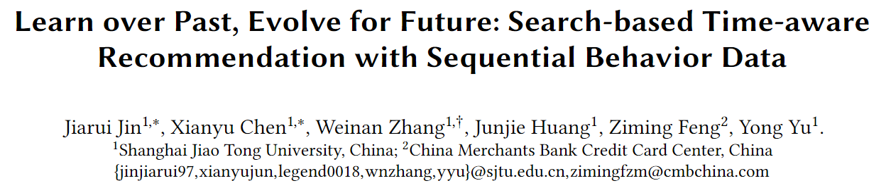
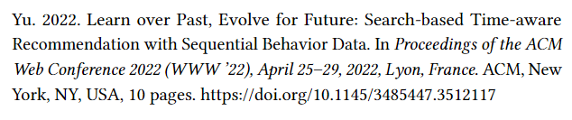
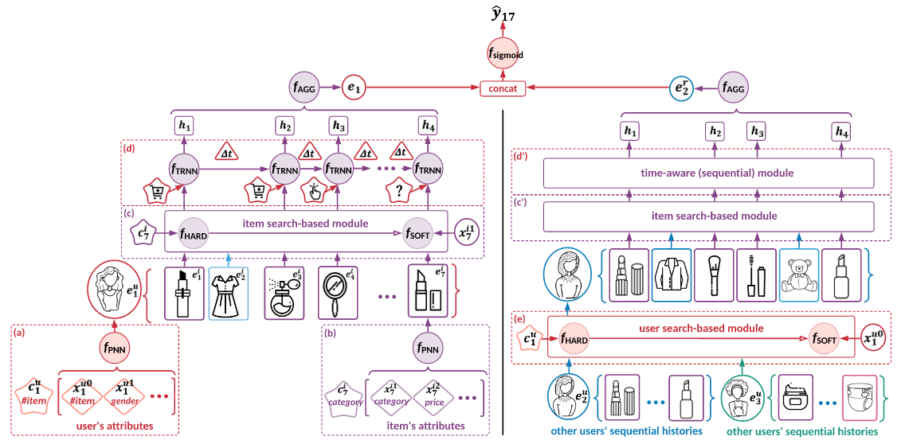

    
    

### 背景

由于用户的历史行为的快速增长，个性化推荐系统至关重要，因为用户需求不仅受其个人资料的影响，还受到其近期浏览行为和过去一段时间的定期购买的影响。经典的推荐方法，包括基于协同过滤的模型和基于分解机的模型，主要集中在对用户的一般兴趣进行建模以找到她最喜欢的产品；同时不太及时探索用户的需求。但时间无疑是一个重要的因素，可以显著影响用户的需求，导致用户行为的周期性。

### 结果

STARec框架的三大贡献：

1. 提出了一个结合搜索模块和时间感知模块的框架，能够捕捉用户的时间敏感需求。
2. 将用户的历史反馈作为输入，并证明标签信息能够提升模型表现。
3. 设计了一个自适应搜索机制，从硬搜索逐渐过渡到软搜索。
这个过程的核心是整合用户的多维信息（历史行为、相似用户的行为、时间因素和反馈信号），并通过自适应的搜索机制逐步提升推荐的精准度。

* 实验结果： 在三个真实商业数据集上进行的点击率预测任务中，STARec 展现了优于现有最先进方法的性能。
* 在线实验结果： 在公司 X 的日常物品推荐平台上，STARec 在两个主要推荐场景中分别提高了大约 6% 和 1.5% 的点击率指标。

### 算法流程

本文提出了一个新框架——基于搜索的时间感知推荐（STARec）。STARec 旨在通过一个统一的搜索和时间感知模型来捕捉用户需求的演变。

#### 1. 检索并混合历史和最近浏览记录：
* 模型首先从用户的历史行为中检索相关商品，并与她最近浏览的商品结合起来。
* 这些混合后的数据被输入到一个时间感知的序列网络（time-aware sequential network），该网络不仅考虑商品的顺序，还考虑它们之间的时间间隔，以便捕捉用户的时间敏感需求。

#### 2. 引入相似用户的历史记录：
* 除了用户自己的历史行为，模型还从相似用户的历史记录中挖掘额外的信息。。
* 相似度的计算方式：
可以通过用户嵌入向量的内积软性估算相似度。
也可以通过硬性方式，比如计算购买了与商品𝑖1同类别商品的数量。

#### 3. 标签技巧：引入用户的反馈作为输入：
* 不同于目前流行的推荐方法只将用户的点击或购买行为作为监督信号，STARec模型还将用户的之前反馈（如点击、购买）作为输入。
* STARec将目标商品的标签（例如点击或购买的反馈）设置为随机值。目的在于避免模型过度依赖某些商品的标签。例如，如果用户点击了某个商品𝑖1，那么她可能不会再对类似的商品产生兴趣。如果模型将所有标签都视为确定性的1或0，可能会错过一些用户的潜在兴趣点。

#### 4. 适应性搜索机制：
* 设计了一种新的自适应搜索机制，该机制能够根据嵌入向量的调整情况，逐渐从硬搜索策略（基于类别ID）转向软搜索策略（基于类别嵌入相似度）。

------------------------------------------------------------------------------

### 基于搜索的推荐模型

背景：用户行为数据规模庞大，随着用户的行为数据不断增加，使用整个用户历史进行训练和预测变得不切实际。因为推荐系统需要在短时间内进行计算，但海量的历史数据会使得模型训练和推荐时间大幅增加，导致系统效率降低。

* 所以使用硬搜索或软搜索策略从用户的整个行为历史中检索相关的记录，而不是仅限于最近行为。
* 好处是筛选相关物品：通过搜索模型，可以找到那些与当前推荐任务最相关的用户行为，而不是处理用户的所有历史数据。这在保持效率的同时，能够捕捉用户的长期偏好和依赖性。

