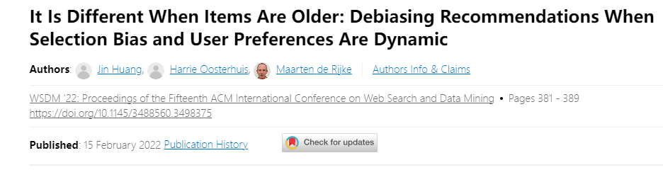
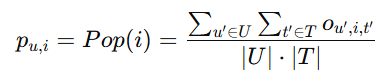
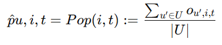
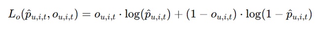
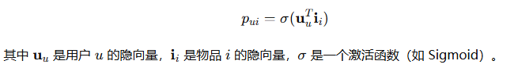

### 背景

与推荐系统的用户交互受到用户选择偏差的影响，例如，用户更有可能对流行的项目（流行度偏差）或他们期望事先享受的项目（积极偏差）进行评分。存在减轻用户评分中选择偏差对推荐系统评估和优化的影响的方法。然而，这些方法将选择偏差视为静态的，尽管项目的流行可能会随着时间的推移发生巨大变化，并且用户偏好也可能随着时间的推移而变化的事实。

我们专注于项目的年龄及其对选择偏差和用户偏好的影响。
我们的实验分析表明：在考虑项目年龄对偏差和偏好的影响的方法下，用户在 MovieLens 数据集上的评分行为更好地被捕获。

### 目的

理论上，在选择偏差和用户偏好动态的动态场景中，现有的去偏方法不再无偏。为了解决这个限制，我们在 dyNamiC scEnaRio (DANCER) 中引入了 DebiAsing，这是一种新的去偏方法，扩展了逆倾向评分去偏方法以考虑动态选择偏差和用户偏好。

### 结论

实验结果表明，与错误地假设选择偏差在动态场景中是静态的去偏方法相比，DANCER 提高了评级预测性能。据我们所知，DANCER 是第一个解释RS中动态选择偏差和用户偏好的去偏方法。

### 贡献

(1) MovieLens 数据集中动态选择偏差和动态用户偏好的分析和估计； 

(2) DANGCER：一种适用于 dyNamiC scEnaRio 中的债务的一般去偏方法； 

(3) 时间感知矩阵分解 (TMF)-DANCER ：据我们所知，这是第一个纠正动态选择偏差并对动态用户偏好进行建模的推荐方法。

### 对于本文IPS的pui计算的改进

#### 静态 IPS 的局限：

    传统的静态 IPS 估计 pui时，将所有时间维度的影响平均化，没有考虑用户对物品的兴趣在不同时期可能是不同的。这种方法在假设用户偏好和选择偏差是静态的，而实际上，这些因素是动态变化的。

#### DANCER 的改进：

    DANCER 提出了动态选择偏差的处理方法，它引入了puit ，即考虑了时间维度的概率估计。通过使用 流行度（如 Pop(i,t)）来初步估计puit，模型能够捕捉物品在不同时间段的选择概率。相较于传统方法，DANCER 不再简单地将时间因素平均化，而是通过流行度反映物品在特定时间段的受欢迎程度，继而计算用户在不同时间段对某个物品打分的概率。

#### 负对数似然优化：

    初步使用 Pop(i,t) 来估计puit之后，DANCER 使用负对数似然损失（NLL）进一步优化这些估计值，以确保它们更好地反映实际的评分数据。

### IPS pui的总结

IPS是一种用来校正推荐系统中的选择偏差的方法。它通过估计用户被推荐某项物品的概率，然后利用该概率对观测到的用户行为进行加权，从而消除因数据不均衡带来的偏差。IPS 的核心思想是赋予低频被推荐物品更高的权重，以便更准确地估计这些物品的效用。

* 基于流行度的计算
  
    物品 𝑖 的 𝑝𝑢𝑖是物品 𝑖 被交互（例如点击、购买等）的次数与总交互次数的比例

* 基于曝光率的估计
  
    可以统计用户 𝑢被展示物品 𝑖的次数占用户总展示次数的比例

* 基于用户与物品特征的建模
  
    使用机器学习模型（例如逻辑回归、决策树、神经网络等）来估计 𝑝𝑢𝑖。这种方法可以将用户特征（如年龄、性别、地域、历史行为）和物品特征（如类别、价格、流行度）作为输入特征，训练一个模型来预测用户与物品的交互概率。

    公式形式为：𝑝𝑢𝑖=𝑓(用户特征,物品特征)这种方法通过学习更复杂的用户-物品关系，可以提供更精准的 propensity score 估计。

* 基于协同过滤的方法
    通过协同过滤模型（如矩阵分解、神经协同过滤等）也可以估计 𝑝𝑢𝑖。这类方法使用历史交互数据，学习用户和物品的隐式向量表示，并使用这些向量计算用户与物品交互的可能性。
    
* 基于倾向评分的分层方法
    有时可以结合用户的不同群体特征（如新用户、老用户）分层估计 propensity score。例如，新用户的 𝑝𝑢𝑖可以使用一个全局模型估计，而老用户的 𝑝𝑢𝑖则可以根据其个人历史行为和偏好来进行个性化估计。
### 实验主要现象和结论

### 文章好在哪里？

DANCER算是对IPS的改进，考虑了时间因素，感觉像是这一块领域的初期成果。

### 自我想法

文中是将DANCER和TMF相结合，同理也可以和其他深度学习算法结合起来

文中的时间因素层面考虑的还是不够多，没有对时间层面具体细化。
